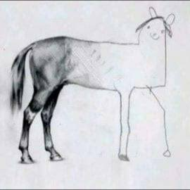

# Domain-Driven Design (DDD): Melhorando a Capacidade e Performance de Equipes de Desenvolvimento

Um modelo de domínio reflete as regras, processos e a realidade do negócio. DDD tem como pressuposto o alinhamento entre o desenvolvimento de software e os objetivos e necessidades do negócio, diminuindo atritos e falhas na comunicação entre equipes técnicas, stakeholders e clientes. O objetivo inicial deste texto é abordar como DDD pode ser uma mão na roda para o aumento da capacidade e performance de equipes de desenvolvimento.

---

## O que é Domain-Driven Design?
Domain-Driven Design, ou DDD, é uma metodologia que enfatiza a importância de entender profundamente o domínio do problema antes de desenvolver soluções. Os princípios básicos de DDD incluem a criação de um modelo de domínio claro, a utilização de uma linguagem ubíqua (falar a mesma linguagem, evitando desentendimentos evitáveis - não turve a água para simular profundidade..." ou algo assim, me veio essa frase na cabeça, menção honrosa ao autor, que não lembro), e a definição de contextos delimitados. Um modelo de domínio bem definido ajuda a garantir que todos os envolvidos no projeto tenham um entendimento comum do problema e da solução.

---

## Contextos Delimitados 

Contextos delimitados são divisões lógicas dentro de um domínio que estabelecem limites claros em torno de um conjunto específico de conceitos e regras. Cada contexto delimitado possui seu próprio modelo de domínio, isolando-o dos outros contextos para evitar conflitos e ambiguidades. Por exemplo, em um sistema de e-commerce, podemos ter contextos delimitados para gestão de pedidos, processamento de pagamentos e autenticação de usuários. Essa separação facilita a manutenção e a escalabilidade do sistema.

---

## Espaço Problema vs. Espaço Solução

O espaço problema envolve a compreensão dos desafios e necessidades do negócio, enquanto o espaço solução foca em como resolver esses problemas. Esta distinção garante que o desenvolvimento do software esteja alinhado com os objetivos do negócio e permite uma abordagem estruturada para resolver problemas complexos.

---

## Elementos Transversais no DDD

Elementos transversais, ou cross-cutting concerns, são aspectos do sistema que afetam múltiplas partes do software, como log, autenticação e segurança. Eles são gerenciados de forma modular para promover a separação de preocupações. Técnicas como Aspect-Oriented Programming (AOP), middleware e interceptores são comumente usadas para implementar esses elementos, melhorando a modularidade e a reutilização do código.

---

## Benefícios de DDD para Equipes de Desenvolvimento

1. **Modularidade e Separação de Preocupações:**  DDD promove a criação de módulos coesos e independentes, facilitando a manutenção e evolução do sistema.

2. **Melhoria na Comunicação:** a Linguagem Ubíqua garante que todos os membros da equipe, incluindo stakeholders e clientes, utilizem os mesmos termos e conceitos, reduzindo mal-entendidos.

3. **Foco na Necessidade do Negócio:** DDD assegura que o desenvolvimento do software esteja alinhado com os objetivos e prioridades do negócio, resultando em soluções mais eficazes.

4. **Facilidade de Manutenção e Escalabilidade:** Com contextos delimitados bem definidos, é mais fácil realizar mudanças e adicionar novas funcionalidades sem impactar negativamente outras partes do sistema.

---

## Se chegou até aqui, muito obrigado

Depois de alguns anos de experiência em empresas de tecnologia, uma percepção foi se formando na minha mente, como uma nuvem única carregando chuva em um dia ensolarado (sendo o dia ensolarado uma pessoa que entra no mundo tech cheia de sonhos e achando que a vida é fácil). Essa percepção de que uma das maiores dores que afetam times de desenvolvimento é a falta de comunicação clara entre time técnico, de produto e stakeholders. Muitas vezes jargões são usados, palavras que não são conhecidas por todos envolvidos, egos são acariciados e o medo de parecer menos genial que os outros sentados à mesa faz com que o resultado final não saia como o esperado (vide aquele meme do cavalo, que começa sendo desenhado perfeitamente e termina de uma maneira... estranha). DDD vem com o intuito de auxiliar nessa melhor compreensão do domínio do problema e criação de soluções de software que realmente atendam às necessidades do negócio. Não vai ser a bala de prata, mas talvez o desenho do cavalo realmente pareça um cavalo.

